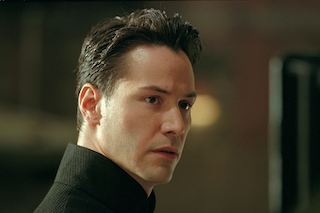

 # Мунгалов Игорь Валерьевич
### О себе:
Родился 04.06.1985 в г. Джамбул Казахской ССР. В 2003 году окончил среднюю школу-гимназию № 24. Многократный победитель и призер международных соревнований по Таеквондо.
#### Высшее образование: 
2003 - 2009 Балтийский государственный технический университет ВОЕНМЕХ им. Д.Ф. Устинова, Санкт-Петербург
Факультет: Международный промышленный менеджмент, Маркетинг
Степень: магистр
#### Опыт работы:
* Февраль 2009 — по настоящее время: ООО "Страга" - Заместитель генерального директора
* Октябрь 2008 — январь 2009: ООО "ИнвестПромКонсалт" - Начальник отдела продаж
* Апрель 2008 — сентябрь 2008: ООО "Эксперт Сервис" - Начальник отдела продаж
* Март 2007 — август 2007 - Банк Русский Стандарт - менеджер отдела привлечения клиентов. ИО Ведущего менеджера
### Ключевые навыки:
* Умение организовать команду для получения высоких результатов
* Пунктуальность
* Самоорганизованность
* Опыт ведения проектов: разработка ПО, сайты, РК
* Опыт проведения переговоров с заказчиками
